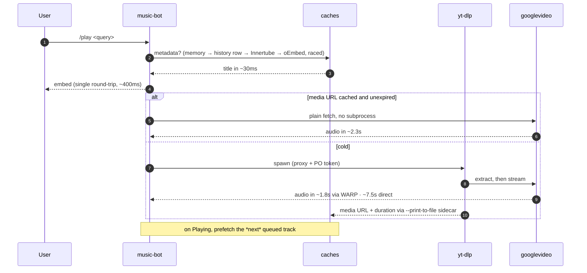
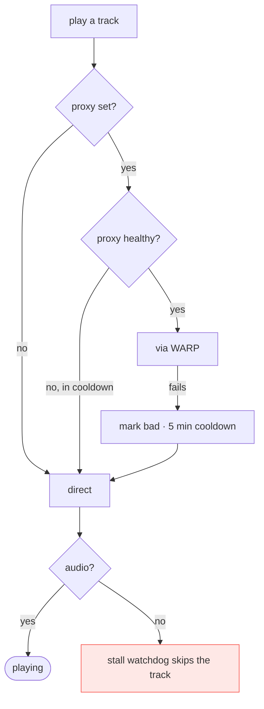

# Architecture

Three containers. The bot does Discord and playback; two sidecars exist purely
to make YouTube fast and reliable from a datacenter IP. This file explains what
each one buys, with the measurements that justify it — the setup carries real
complexity and none of it is worth keeping without evidence.

Deployment runbook: [`DEPLOY.md`](DEPLOY.md). Standalone setup:
[`docker-compose.yml`](../docker-compose.yml).

## Containers

```mermaid
flowchart LR
    subgraph discord[" "]
        D([Discord])
    end

    subgraph host["VPS · Oracle Ampere arm64 · 2 cores"]
        subgraph net["docker network: ytpot"]
            BOT["<b>music-bot</b><br/>Deno · discord.js<br/>spawns yt-dlp"]
            POT["<b>bgutil-provider</b><br/>PO-token minting<br/>:4416"]
            WARP["<b>warp</b><br/>Cloudflare WARP<br/>SOCKS5 :1080"]
        end
        VOL[("/data/ytdlp-cache<br/>bind mount")]
    end

    YT([YouTube<br/>+ googlevideo CDN])
    TURSO([(Turso<br/>song history)])

    D <-->|"gateway + REST"| BOT
    BOT -->|"HTTP: get_pot"| POT
    BOT -->|"yt-dlp --proxy"| WARP
    BOT --- VOL
    BOT -->|"metadata: oEmbed / Innertube"| YT
    BOT <-->|"history, /play cache"| TURSO
    WARP -->|"clean egress IP"| YT
    POT -->|"BotGuard attestation"| YT

    classDef side fill:#1f6feb22,stroke:#1f6feb
    class POT,WARP side
```

**Only yt-dlp traffic goes through WARP.** Discord, Turso, oEmbed and Innertube
all egress directly — the proxy is passed as a yt-dlp flag, not a system route.

## Why each sidecar exists

Measured on the prod host, 12 videos, time to first audio byte:

| config | time | works |
| --- | --- | --- |
| direct + cookies + PO token | 7.4–8.3s | yes |
| direct, no cookies | 1.2–1.6s | **1 of 4** |
| WARP, no cookies, no PO token | 1.7–1.9s | **3 of 4** |
| **WARP + PO token, no cookies** | **1.6–2.2s** | **12 of 12** |

Two independent findings:

- **Cookies are what cost ~6s.** An authenticated session makes YouTube demand
  the full player-JS + nsig chain on every play. They are not slow *because* of
  the datacenter IP — the same cookies are slow through WARP too.
- **The PO token is what makes the no-cookie path reliable**, and it costs 13ms.
  Without it, most videos return no audio.

So `warp` buys speed (it makes dropping cookies possible) and `bgutil` buys
reliability. Neither substitutes for the other.

### What a cold play actually spends

Timestamped from a real extraction, direct with cookies:

| step | elapsed |
| --- | --- |
| python + yt-dlp import | 560ms |
| downloading watch page | 1737ms |
| player API JSON + PO tokens | 1973ms |
| deno solves the JS challenge | 3627ms |
| format 251 chosen | 3740ms |
| first byte from googlevideo | ~7600ms |

The pieces are individually fast — the 2.5MB player JS downloads in 58ms, deno
starts in 25ms, a PO token is 13ms. It is the sequential chain plus the CDN's
own first-byte latency that adds up.

## Playback path

Everything upstream of "first audio byte" is overhead the caches try to avoid.



Three caches, each removing a different cost:

- **Metadata** (memory → `song_history` → Innertube → oEmbed, raced): title in
  ~30ms instead of a 3.7s yt-dlp call. Raced rather than chained because each
  source misses often; chaining paid the sum of the misses.
- **Format URL**, keyed by video id, expiring on the URL's own `expire` param
  minus 10 minutes. A repeat play becomes a plain `fetch` with no subprocess.
  Captured for free from the streaming run's `--print-to-file` sidecar.
- **Prefetch**: the next queued track is resolved while the current one is
  *playing* — never while one is starting. On 2 cores, a second extraction
  alongside a starting stream cost 6.9s of silence.

A cached URL is an optimisation and never a dependency: any non-OK status or
throw evicts the entry and falls back to yt-dlp.

## Failure modes



| if this breaks | symptom | what happens |
| --- | --- | --- |
| `warp` | slower plays | falls back to direct + cookies after one failure, retries the proxy in 5 min |
| `bgutil` | some videos fail | cookies still carry the authenticated path |
| both | back to ~7.5s | works, just slow — this is the pre-sidecar baseline |
| cookies expire | "Sign in to confirm" | only matters when the proxy is down; re-export per DEPLOY.md |

Keeping `YOUTUBE_COOKIES` set is what makes the fallback meaningful, even once
the proxy path stops needing it day to day.

**Cookies are deliberately omitted while the proxy is healthy.** Sending them
through the proxy is just as slow as sending them direct, so leaving them on
would make `YTDLP_PROXY` pointless. They return the instant anything falls back.

**The fast path is ~95% reliable** (18 of 19 measured), and a stream has no
retry of its own — so a stalled stream forces the direct, cookie-authenticated
path and replays the same track once before giving up on it. A second stall is
treated as a genuinely bad track.

## Known sharp edges

- **PO tokens are minted from the host IP while media is fetched through WARP.**
  Two different IPs. It works today; if YouTube ever binds tokens to the
  requesting IP, this breaks and `bgutil` would need routing through WARP too.
- **Free WARP is unproven at sustained load.** The measurements above span
  minutes, not days. Cloudflare egress IPs are shared, so YouTube's tolerance
  may drift.
- **`/data/ytdlp-cache` must be a real volume.** Without one it is wiped every
  deploy and the player/signature caches start cold each release.
- **Playback is sequential by design.** Two concurrent yt-dlp processes on 2
  cores directly delay the audio a user is waiting for.
