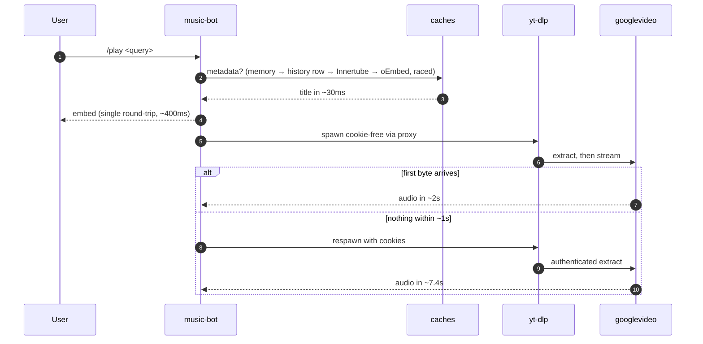
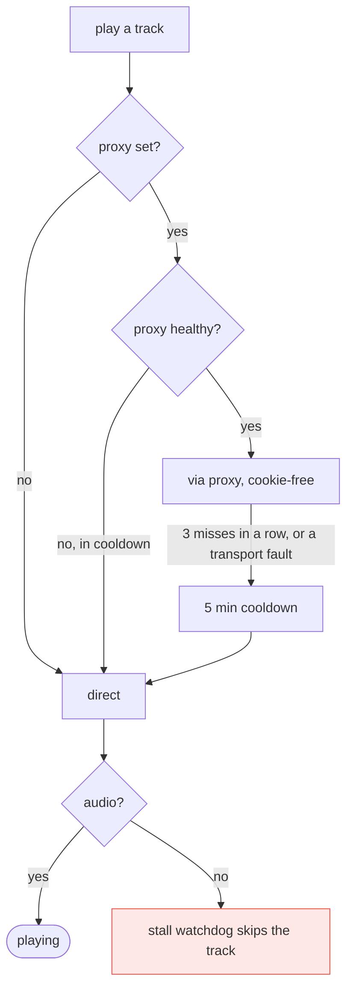

# Architecture

Three containers. The bot does Discord and playback; two sidecars exist purely
to make YouTube fast and reliable from a datacenter IP. This file explains what
each one buys, with the measurements that justify it — the setup carries real
complexity and none of it is worth keeping without evidence.

Deployment runbook: [`DEPLOY.md`](DEPLOY.md). Standalone setup:
[`docker-compose.yml`](../docker-compose.yml).

## Containers

```mermaid
flowchart LR
    subgraph discord[" "]
        D([Discord])
    end

    subgraph host["VPS · Oracle Ampere arm64 · 2 cores"]
        subgraph net["docker network: ytpot"]
            BOT["<b>music-bot</b><br/>Deno · discord.js<br/>spawns yt-dlp"]
            POT["<b>bgutil-provider</b><br/>PO-token minting<br/>:4416"]
        end
        VOL[("/data/ytdlp-cache<br/>bind mount")]
    end

    YT([YouTube<br/>+ googlevideo CDN])
    TURSO([(Turso<br/>song history)])

    D <-->|"gateway + REST"| BOT
    BOT -->|"HTTP: get_pot"| POT
    BOT --- VOL
    BOT -->|"metadata: oEmbed / Innertube"| YT
    BOT <-->|"history, /play cache"| TURSO
    POT -->|"BotGuard attestation"| YT

    classDef side fill:#1f6feb22,stroke:#1f6feb
    class POT side
```

## Why the sidecar exists — and where the proxy went

The historical numbers, measured on the prod host (12 videos, time to first
audio byte), when Cloudflare WARP still provided a clean egress:

| config | time | works |
| --- | --- | --- |
| direct + cookies + PO token | 7.4–8.3s | yes |
| direct, no cookies | 1.2–1.6s | **1 of 4** |
| clean proxy, no cookies, no PO token | 1.7–1.9s | **3 of 4** |
| **clean proxy + PO token, no cookies** | **1.6–2.2s** | **12 of 12** |

Two findings that still hold:

- **Cookies are what cost time.** An authenticated session makes YouTube demand
  the full player-JS + nsig chain (and, for a free account, a pre-roll ad wait —
  see the `use_ad_playback_context` notes in CLAUDE.md, which cut the cookied
  path to ~3.5s). They are not slow *because* of the datacenter IP.
- **The PO token is what makes a cookie-free path reliable**, and it costs 13ms.

**WARP itself is gone (2026-08-27).** YouTube now flags the whole WARP pool:
login gates, then CDN 403s on unauthenticated downloads, across three exits in
two /48s — rotation inside the pool cannot escape a class-level flag. The
`YTDLP_PROXY` knob stays in code for any future clean egress (a residential IP
was verified to serve cookie-free audio with *no PO token at all*; a static ISP
proxy is the realistic always-up candidate). `bgutil` stays: it refreshes the
authenticated session (cookie longevity) and is what would make a restored
fast path 12/12 instead of 3/4.

### What a cold play actually spends

Timestamped from a real extraction, direct with cookies:

| step | elapsed |
| --- | --- |
| python + yt-dlp import | 560ms |
| downloading watch page | 1737ms |
| player API JSON + PO tokens | 1973ms |
| deno solves the JS challenge | 3627ms |
| format 251 chosen | 3740ms |
| first byte from googlevideo | ~7600ms |

The pieces are individually fast — the 2.5MB player JS downloads in 58ms, deno
starts in 25ms, a PO token is 13ms. It is the sequential chain plus the CDN's
own first-byte latency that adds up.

## Playback path

Everything upstream of "first audio byte" is overhead the caches try to avoid.



Three caches, each removing a different cost:

- **Metadata** (memory → `song_history` → Innertube → oEmbed, raced): title in
  ~30ms instead of a 3.7s yt-dlp call. Raced rather than chained because each
  source misses often; chaining paid the sum of the misses.
- **Fast path with fallback**: a cold play first tries cookie-free through the
  proxy (~2s) and falls back to the authenticated path (~7.4s) if no audio
  arrives. `createStream` waits for a real first byte before handing the
  resource to the player, so a miss costs <1s instead of a 25s stall.

There is deliberately **no media-URL cache**. One existed and had to be removed:
a googlevideo URL fetched with a plain GET is truncated by the server — on a
4:19 track `clen` was 4,429,008 bytes and a single `fetch` returned 622,592, so
playback ended a few seconds in. yt-dlp ranges its own downloads, which is why
it is correct. Reinstating the cache means writing a ranged reader first; the
cookie-free path already gets a cold play to ~2s without one.

## Failure modes



| if this breaks | symptom | what happens |
| --- | --- | --- |
| `bgutil` | little, day to day | the streaming path is cookied; the provider mainly extends cookie life |
| a future `YTDLP_PROXY` | slower plays | transport-fault detection + a 3-miss strike counter demote it; plays fall back to direct + cookies |
| cookies expire | "Sign in to confirm" | re-export per DEPLOY.md — cookies carry the whole streaming path now |

**Cookie-free logic is dormant, not deleted.** `createStream` still tries the
cookie-free proxied path first whenever `YTDLP_PROXY` points somewhere healthy;
with the var unset every play goes straight to the direct cookied path (~3.5s
cold with the `web_music` + ad-context pin, no doomed attempt in front). The
first-byte check that made the speculative attempt affordable is unchanged.

## Known sharp edges

- **PO tokens are minted from the host IP.** With a future proxy, media would
  fetch from a different IP than the token was minted from. It worked under
  WARP; if YouTube ever binds tokens to the requesting IP, `bgutil` would need
  routing through the proxy too. (googlevideo media URLs are already IP-bound —
  extraction and download must egress the same IP, which is why only *sticky*
  proxies are viable, never per-request rotation.)
- **`/data/ytdlp-cache` must be a real volume.** Without one it is wiped every
  deploy and the player/signature caches start cold each release.
- **Playback is sequential by design.** Two concurrent yt-dlp processes on 2
  cores directly delay the audio a user is waiting for.
